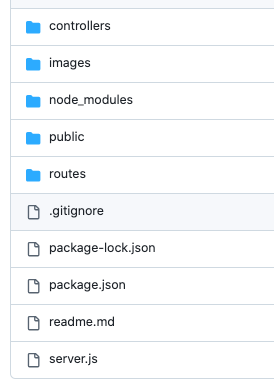

# 📝 To-Do App (JavaScript + Node.js)

A simple full-stack To-Do List app built with **Node.js**, **Express**, and **Vanilla JavaScript**.  
It allows users to add, edit, and delete to-dos with timestamps. Pressing `Enter` adds a new task instantly.

---

## 🚀 Features

- ✅ Add to-dos with timestamps  
- ✅ Press `Enter` to add new tasks  
- ✅ Edit and save existing to-dos  
- ✅ Delete tasks  
- ✅ Clean and responsive UI  

---

## ⚙️ Setup Instructions

1. **Clone the repository**

```bash
git clone https://github.com/shegezzy/to-do.git
cd todo-app-js
````

2. **Install dependencies**

```bash
npm install
```

3. **Start the server**

```bash
node server.js
```

4. **Open your browser and visit**

```
http://localhost:3000
```

---

## ✏️ How to Use

* Type your to-do in the input field and press **Enter** or click **Add**.
* Click **Edit** next to any task to modify it, then click **Save**.
* Click **Delete** to remove a to-do.

---

## 🧰 Built With

* Node.js
* Express
* HTML5 & CSS3
* JavaScript (ES6)

---

## 🗂 Project Structure

This screenshot shows how the files are organized in the repository:



---

## 📸 Application Screenshot

Here is how the app looks when running:


---

## 📄 License

This project is licensed under the MIT License.

---

## 🙌 Acknowledgements

Built for learning and demonstration purposes, inspired by common productivity applications.

```