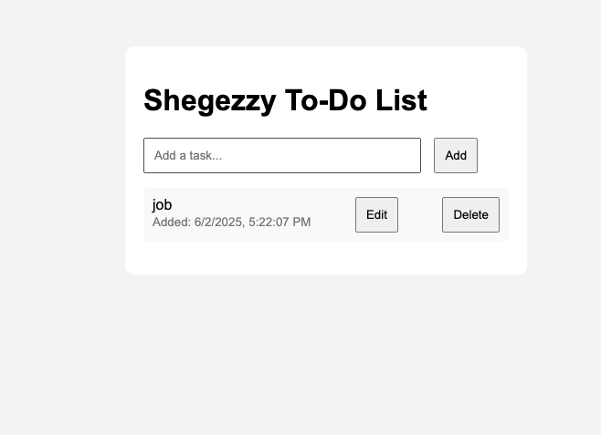

### 📄 `README.md`

```markdown
# 📝 To-Do App (JavaScript + Node.js)

A simple full-stack To-Do List app built with **Node.js**, **Express**, and **Vanilla JavaScript**. It allows users to add, edit, and delete to-dos with timestamps. Pressing `Enter` adds a new task instantly.

---

## 🚀 Features

- ✅ Add to-dos with timestamp
- ✅ Press `Enter` to add
- ✅ Edit and save existing to-dos
- ✅ Delete tasks
- ✅ Responsive UI with clean design

---

## 🗂 Folder Structure

```

.
├── controllers/
│   └── todoController.js
├── public/
│   ├── index.html
│   ├── app.js
│   └── style.css
├── server.js
└── README.md

````

---

## ⚙️ Setup Instructions

1. **Clone the repo**

```bash
git clone https://github.com/shegezzy/to-do
cd todo-app-js
````

2. **Install dependencies**

```bash
npm install
```

3. **Start the server**

```bash
node server.js
```

4. **Visit in browser**

```
http://localhost:3000
```

---

## ✏️ How to Use

* Type your to-do in the input field and press **Enter** or click **Add**.
* Click **Edit** to modify a to-do. Save changes by clicking **Save**.
* Click **Delete** to remove a to-do.

---

## 🧰 Built With

* Node.js
* Express
* HTML5 + CSS3
* JavaScript (ES6)

---

## 📸 Screenshot



---

## 📄 License

MIT License

---

## 🙌 Acknowledgements

Inspired by real-world productivity needs and built for practice and demonstration.


